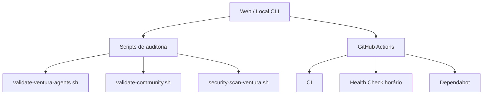

# Ambiente de Teste e Auditoria — Ventura Agents

Arquitetura de validação pós-melhorias (funcionalidade, performance, segurança, community).

## Módulos

| Módulo | Objetivo | Como rodar |
|--------|----------|------------|
| Funcionalidade | LICENSE, docs, typecheck, tests, build, compose | `bash scripts/validate-ventura-agents.sh` |
| Community | CoC, CONTRIBUTING, templates, SECURITY | `bash scripts/validate-community.sh` |
| Segurança | npm audit + heurística de secrets | `bash scripts/security-scan-ventura.sh` |
| CI contínuo | typecheck/test/build + Docker | `.github/workflows/ci.yml` |
| Health horário | mesma suíte a cada hora | `.github/workflows/health-check.yml` |

## Endpoint local

Com o servidor no ar (`npm run dev` ou Docker):

- `GET /health` — readiness
- `GET /v1/agents` — catálogo
- `GET /v1/agents/:id` — agente específico

## Timeline sugerida (48h)

1. **Dia 0** — merge das melhorias; CI verde
2. **24h** — health-check horário; `validate-*` local
3. **48h** — security scan + community audit + decisão de release `v3.0.0`

## Metas

| Área | Meta |
|------|------|
| Build / typecheck / tests | 100% passando |
| Community files | LICENSE, CoC, CONTRIBUTING, SECURITY, issue+PR templates |
| Segurança | 0 secrets óbvios; npm audit sem high/critical |
| Token reduction (produto) | ~90% (Context Proxy) — validar em runtime |
